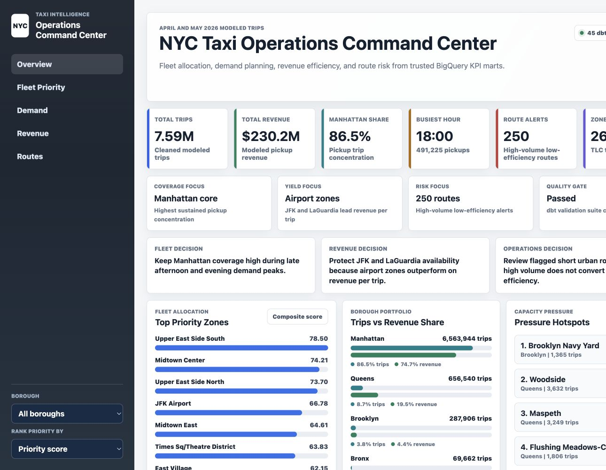

# NYC Taxi Intelligence

[](https://github.com/ilyassfcb11-lgtm/nyc-taxi-intelligence/actions/workflows/ci.yml)

I built this project to practice the full workflow behind a business intelligence dashboard: getting raw data, loading it into a warehouse, cleaning and modeling it with SQL/dbt, checking data quality, and turning the final tables into something a manager could actually use.

The dataset is NYC Yellow Taxi trip data from the Taxi & Limousine Commission. The current version uses April and May 2026 and includes more than 7.9 million raw trips.



Live dashboard: [ilyassfcb11-lgtm.github.io/nyc-taxi-intelligence](https://ilyassfcb11-lgtm.github.io/nyc-taxi-intelligence/)

## What This Project Does

- Downloads official NYC taxi source files.
- Loads the raw trip and zone data into BigQuery.
- Uses dbt to build cleaned staging tables, fact/dimension tables, and KPI marts.
- Tests the modeled data with 45 dbt checks.
- Exports Tableau-ready datasets.
- Includes a dashboard preview focused on demand, revenue, route performance, and operating pressure.
- Runs a GitHub Actions check whenever code is pushed.

## Business Question

I treated this like a fleet operations problem. If someone had to decide where to place taxis, which zones need attention, and which routes are underperforming, what tables and metrics would they need?

The dashboard is built around four questions:

- Where is demand highest?
- Which zones generate the most pickup revenue?
- Which hours have the strongest pickup volume?
- Which high-volume routes have weaker revenue or efficiency?

## Tech Stack

| Layer | Tools |
| --- | --- |
| Ingestion | Python, requests, Google Cloud BigQuery client |
| Warehouse | Google BigQuery |
| Transformation | SQL, dbt, dbt-bigquery |
| Data Quality | dbt generic tests, custom dbt SQL tests |
| Visualization | Tableau-ready CSV extracts, HTML/CSS/JS dashboard preview |
| CI/CD | GitHub Actions |

## Architecture

```text
NYC TLC trip files
        |
        v
Python ingestion
        |
        v
BigQuery raw tables
        |
        v
dbt staging models
        |
        v
dbt core fact/dimension models
        |
        v
dbt KPI mart models
        |
        v
CSV extracts and dashboard preview
```

More detail: [ARCHITECTURE.md](ARCHITECTURE.md)

## Data Model

dbt builds three modeling layers:

| Layer | Purpose | Example Models |
| --- | --- | --- |
| Staging | Clean and standardize raw source tables | `stg_trips`, `stg_zones` |
| Core | Create reusable fact and dimension tables | `fact_trips`, `dim_zone`, `dim_date` |
| Marts | Create KPI tables for the dashboard | `mart_hourly_demand`, `mart_revenue_efficiency`, `mart_route_analysis`, `mart_operational_kpis` |

## Key Metrics

Current scope uses April and May 2026 Yellow Taxi records.

| Metric | Value |
| --- | ---: |
| Modeled trips | 7.59M |
| Modeled pickup revenue | $230.2M |
| Taxi zones monitored | 265 |
| dbt models | 9 |
| dbt tests passing | 45 |
| High-volume low-efficiency route alerts | 250 |

## Data Quality

The project uses dbt tests for:

- required fields not being null
- unique IDs in dimensions and fact tables
- relationships between fact trips and taxi zone dimensions
- custom business rules for positive distance, duration, revenue, and KPI score ranges

Data quality details: [docs/DATA_QUALITY.md](docs/DATA_QUALITY.md)

## Dashboard

The dashboard preview is an HTML/CSS/JS version of the BI layout I want to recreate in Tableau. It includes:

- summary KPI cards
- operating signal ribbon
- top fleet priority zones
- borough trip and revenue mix
- capacity pressure hotspots
- hourly pickup demand
- route alerts and top revenue routes

Open the live version:

```text
https://ilyassfcb11-lgtm.github.io/nyc-taxi-intelligence/
```

Open this file locally in a browser:

```text
dashboard_preview/index.html
```

Dashboard preview notes: [dashboard_preview/README.md](dashboard_preview/README.md)

## Repository Structure

```text
.
├── ingestion/              # Python download and BigQuery load scripts
├── dbt_project/            # dbt models, tests, sources, and project config
├── dashboard_preview/      # HTML/CSS/JS dashboard concept
├── tableau/                # Tableau-ready extracts and screenshots
├── docs/                   # Business insights, data quality, CI/CD, archive
├── data/                   # Local data folder placeholder; raw files are ignored
├── .github/workflows/      # GitHub Actions CI
├── ARCHITECTURE.md
├── KPIS.md
└── requirements.txt
```

## Run Locally

Install dependencies:

```bash
python -m venv .venv
source .venv/bin/activate
pip install -r requirements.txt
```

Download and load raw data:

```bash
python ingestion/download_data.py
python ingestion/load_to_bigquery.py
```

Run dbt:

```bash
cd dbt_project
dbt run --profiles-dir .
dbt test --profiles-dir .
dbt docs generate --profiles-dir .
```

The local dbt profile is not committed. Use [dbt_project/profiles.yml.example](dbt_project/profiles.yml.example) as the template.

## CI/CD

GitHub Actions runs on pushes and pull requests to `main`.

Current CI checks:

- Python dependencies install successfully
- ingestion scripts compile
- dbt project parses
- dbt models, tests, and sources can be listed

CI/CD details: [docs/CI_CD.md](docs/CI_CD.md)

## Future Improvements

- Parameterize ingestion for a full-year monthly refresh.
- Add source freshness checks in dbt.
- Add GitHub Secrets and service account authentication for cloud dbt builds.
- Automate monthly ingestion with Cloud Scheduler and Cloud Run.
- Publish the final dashboard to Tableau Public or Looker Studio.

## Selected Documentation

- [Architecture](ARCHITECTURE.md)
- [KPI definitions](KPIS.md)
- [Data quality](docs/DATA_QUALITY.md)
- [CI/CD](docs/CI_CD.md)
- [Business insights](docs/BUSINESS_INSIGHTS.md)
- [Dashboard preview](dashboard_preview/README.md)
