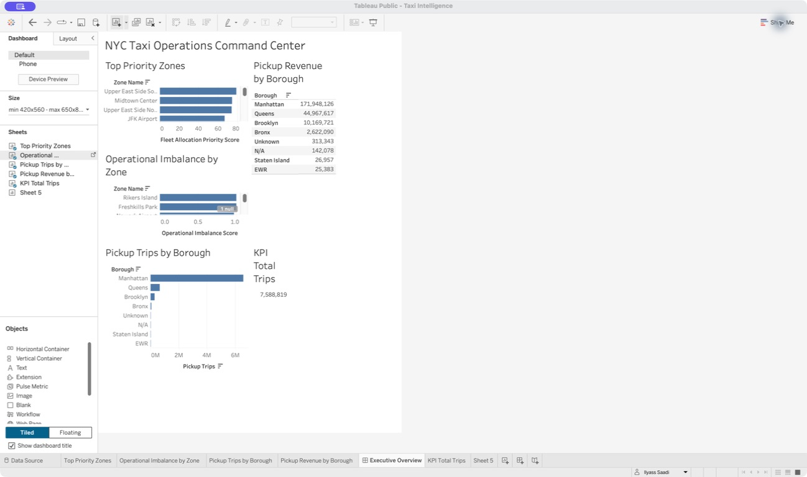
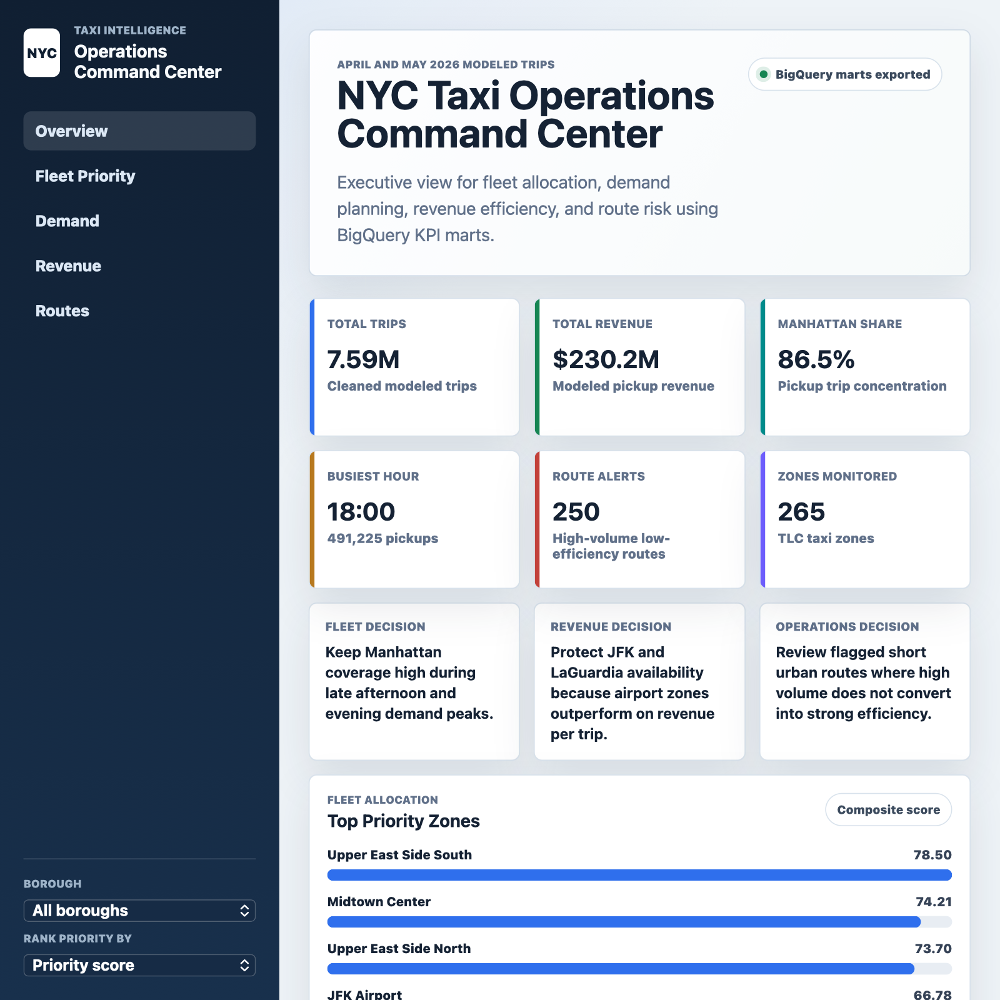

# Tableau Artifacts

This folder contains the Tableau-related files for the dashboard part of the project.

Use it for:

- Tableau workbook notes.
- Dashboard screenshots.
- Tableau exports.
- Dashboard documentation.

Do not put raw taxi data files here.

The dashboard uses BigQuery/dbt KPI tables documented in `docs/build_logs/PHASE_3_TABLEAU_PLAN.md`.

The product dashboard design spec is documented in `tableau/PRODUCT_DASHBOARD_SPEC.md`.

The Tableau rebuild guide is documented in `tableau/TABLEAU_REBUILD_GUIDE.md`.

## Current Dashboard Work

Workbook name:

```text
Taxi Intelligence
```

Main dashboard:

```text
NYC Taxi Operations Command Center
```

Current work-in-progress screenshot:



Dashboard preview render:



Built so far:

- `Top Priority Zones`
- `Pickup Trips by Borough`
- `Pickup Revenue by Borough`
- `Operational Imbalance by Zone`
- `KPI Total Trips`
- `Executive Overview` dashboard layout

Still needed before publishing:

- Additional KPI cards for revenue, zones monitored, and top priority score.
- Cleaner product-style layout and colors.
- Borough and service zone filters.
- Demand, revenue efficiency, route performance, and fleet allocation pages.
- Final Tableau Public link after the dashboard is ready to share.
